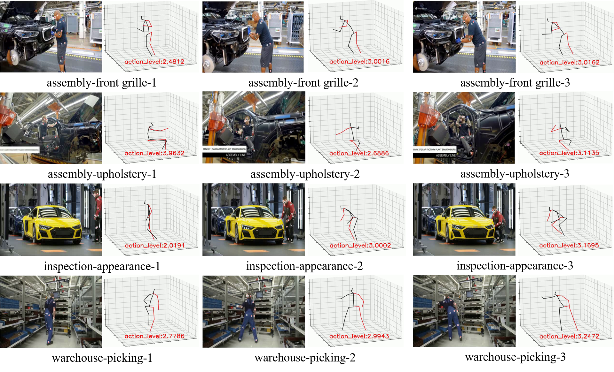
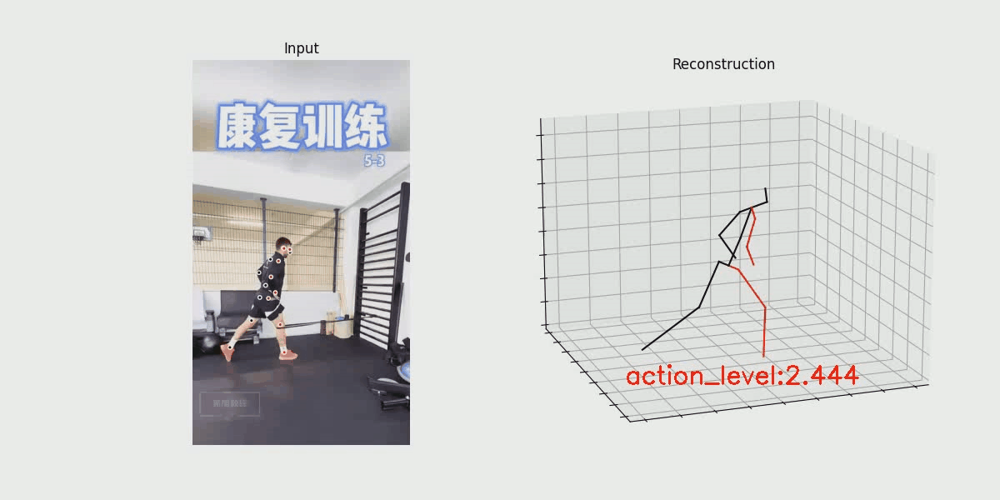

# REBA-PLUS

## Introduce

Aiming to the rough reba assessment approach that the different behavior has the same action level, in this study, a ergonomic assessment tool based on the reba rule is proposed, which can assess the activity of workers in an approximately non-linear form. In order to demonstrate the validity, the quality assessment and analysis had been conducted in different production environment. The visual behavioral risk assessment videos have been released at https://www.youtube.com/watch?v=wSGQK8lYsVs.


*<p align="center">**Evaluation results of different sectors in the automobile manufacturing industry**</p>*

## Quick start 
You can test your custom video as the following preparation in your computer

### Hardware and software requirements
- Ubuntu 18.04  Cuda 10.1
- Anaconda3 Python3.7 Pytorch >= 0.4.0

### Dependencies
please open the terminal, installing the related dependencies by the following command
```sh
pip install -r requirement
```

### Assess the your video
#### At first, obtain the 3d pose
```sh
cd REBA-plus/3dpose_module/
#processs the input video and obtain the 2d pose
scp -r input.mp4 /inference/input_directory  
cd inference    
python infer_video_d2.py  --cfg COCO-Keypoints/keypoint_rcnn_R_101_FPN_3x.yaml  --output-dir output_directory  --image-ext mp4  input_directory

#built custom dataset
cd ../data/
python prepare_data_2d_custom.py -i ../inference/output_directory -o myvideos

# obtain the 3d pose and visual, Replace the MP4 file with your own mp4 filename
cd ..
python run.py -d custom -k myvideos -arc 3,3,3,3,3 -c checkpoint --evaluate reba_pose.bin --render --viz-subject \
input.mp4 --viz-action custom  --viz-camera 0 --viz-video inference/input_directory/input.mp4 --viz-output \
../relation_reasoning_module/input/input_video/outputfile.mp4 --viz-export ../relation_reasoning_module/input/npy_file/outputfile --viz-size 6

```
#### Then, analyze the 3d psoe data and infer the assessment results
```sh
cd ../relation_reasoning_module/

# transform the 3d psoe data to 3d point cloud data
python data_process.py

# assess
python demo.py --log_dir pointnet2_cls_ssg --data_folder outputfile/
```

Based on the above command, a visual video can be obtained in the folder relation_reasoning_module/


## Potential practical applications
In this section, Some potential practical application areas are tested, including construction, agriculture, industry, healthcare, details are as follows:


*<p align="center">**Construction worker-building framework**</p>*


*<p align="center">**Farmer-planting rice**</p>*


*<p align="center">**Production workers-carrying**</p>*


*<p align="center">**Healthcare patients-rehabilitation exercises**</p>*
